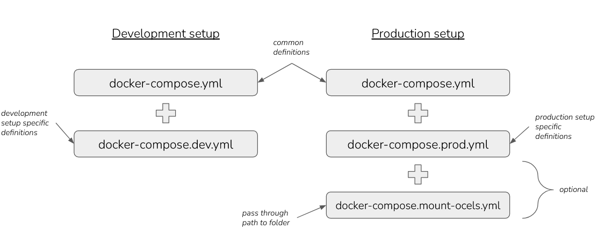

# Explori - Object-Centric Process Mining Using Directly-Follows Multigraphs (DFMs)

## Requirements
- docker, docker-compose

## Getting started
  - `./app.sh --start optional/path/to/event/logs/`: start app in production mode and optionally specify path to a folder containing event logs to mount into the application
  - `./app.sh --start-dev`: start app in development mode
  - `./app.sh --stop`: stop app
  - `./app.sh --remove`: remove created containers, networks, volumes

## Development - Backend

### Requirements
- python >=3.10 (for running native variant)
- docker, docker-compose (for running docker variant)

### 0. Installing dependencies (if at least one component of the following is run in "native" mode)
- `cd backend/`
- Create a new virtual environment: `python -m venv ./venv`
- Activate said environment
  - Windows: `venv\Scripts\activate.bat` (or `activate.ps1` for powershell)
  - Most Linux shells: `source venv/bin/activate`
- Install dependencies: `pip install -r requirements.txt`

### 1. Redis (only docker)
- `docker-compose -f docker-compose.yml -f docker-compose.dev.yml up --build --detach redis`

### 2. Celery

#### Native (this does __not__ work on Windows as Celery doesn't fully support Windows)
- `cd backend/`
- ``PYTHONPATH="src/" celery -A worker.main.app worker --loglevel=INFO``

#### Docker
- `docker-compose build _backend_base && docker-compose -f docker-compose.yml -f docker-compose.dev.yml up --build --detach celery`

It is sufficient to restart the docker container when updating celery worker related code on the host machine as the code 
is mounted into the container. There's no need to rebuild the image or recreate the container, 
a simple restart is enough.

### 3. Fastapi

#### Native
- `cd backend/`
- Start the backend server: `PYTHONPATH="src/" DEV=1 uvicorn server.main:app --host 0.0.0.0 --port 8000`
- See backend address in terminal output

#### Docker
`docker-compose build _backend_base && docker-compose -f docker-compose.yml -f docker-compose.dev.yml up --build --detach fastapi`

### 4. Testing the backend API
- __Assuming__ step 4 above signaled Uvicorn running at `http://0.0.0.0:8000`: The fastapi openapi can be found at `http://0.0.0.0:8000/docs`

### Backend IDE Alternative
- Install Jetbrains PyCharm
- In PyCharm: `File > Open` and select `backend/` folder, select Python 3.10, let PyCharm automatically install dependencies
- To have a run target for the backend
  - Open the file `pycharm-launcher.py`
  - Click on the green arrow
  - On the upper right open the configuration settings
    - Set the working directory to the `backend/` directory (without `src/` at the end)
    - Add `;DEV=1` to the environment variables
- To have a run target for Celery (this does __not__ work on Windows, as Celery doesn't officially support Windows. See `Celery using Docker` above)
  - On the upper left of the "Run/Debug Configurations" window
    - Click the "+" and select "Python"
    - As the script path, choose `venv/bin/celery`
    - As parameters set `-A worker.main.app worker --loglevel=INFO`
    - Set the working directory to the `backend/` directory
- You might need to tell PyCharm that these projects are part of a larger repository, to do so, go into Settings > Version Control > Directory Mappings

## Development - Frontend

### Requirements
- Nodejs

### 0. Installing dependencies (if at least one component of the following is run in "native" mode)
- `cd frontend/`
- Install dependencies: `npm install`.

### 1. Webserver

#### Native
- `cd frontend/`
- Start the frontend server: `npm run start`

#### Docker
- `docker-compose -f docker-compose.yml -f docker-compose.dev.yml up --build --detach webserver`

### Frontend IDE Alternative
- Install Jetbrains WebStorm
- In WebStorm: `File > Open` and select the frontend folder, let Webstorm automatically install dependencies
- You might need to tell WebStorm that these projects are part of a larger repository, to do so, go into Settings > Version Control > Directory Mappings

## General

### Docker

To allow for 2 distinct environments (development, production) there exist 3 main docker-compose files:
- `docker-compose.yml`: contains definitions which are identical in both environments
- `docker-compose.dev.yml`: contains definitions which are specific to the development environment
- `docker-compose.prod.yml`: contains definitions which are specific to the production environment

One always uses the common `docker-compose.yml` file and extends those definitions by additionally 
specifying **either** `docker-compose.dev.yml` **or** `docker-compose.prod.yml` as well (depending on the environment 
one wishes to create). In its simplest form this could look like this: `docker-compose -f docker-compose.yml -f 
docker-compose.prod.yml up`. 

In order to also mount a folder containg event logs into the application, one needs to do 2 things:
- inject the path to that folder via the environment variable `$OCEL_MOUNT_PATH`
- extend the above command mentioned docker compose command by specifying `-f docker-compose.mount-ocels.yml`

All in all this could look like the following:

`OCEL_MOUNT_PATH=path/to/some/folder docker-compose -f docker-compose.yml -f docker-compose.prod.yml -f docker-compose.mount-ocels.yml up`

To reduce the time needed to build the application and avoid building the same image twice (once for celery and 
once for fastapi) given the amount  of shared dependencies, we first build a common docker base image containing 
all "backend dependencies" and then base both celery and fastapi off of it. 
Unfortunately it is not possible to specify a build order in docker-compose yaml files and the newer docker engines 
parallelize the build process, so it is not possible to guarantee that the common docker base image already finished
its build process when docker tries to build celery and fastapi. Because of this we issue 2 separate 
docker-compose commands to build the application:

`docker-compose build _backend_base && docker-compose -f docker-compose.yml ... <same as before> ...`

`_backend_base` is the name of a service simply building an image containing only said shared backend dependencies. 
There's no entrypoint and there will never be a container running that image directly. This way we can guarantee 
that celery's and fastapi's common ancestor image already exists when it's their turn to be built.

All of this is managed by `app.sh` whose usage is described above. In case you want to only run specific components in 
docker (e.g. celery + redis) take a look at the instructions above in the section concerning those specific components. 
Basically: Issue the same kind of docker compose commands as in `app.sh` but append the name of the service to only start
that specific service.
